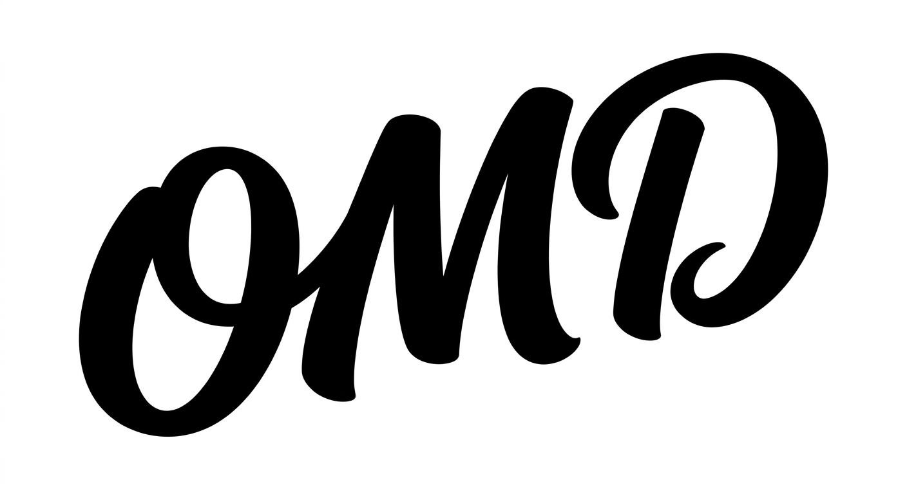

<p align="center">
  
</p>

<h1 align="center">oh-my-design</h1>

<p align="center">
  <strong>67 社の実在する企業デザインシステムから DESIGN.md を生成。</strong>インタラクティブウィザード。AI 呼び出しゼロ。
</p>

<p align="center">
  <strong>新機能: OmD v0.1 Philosophy Layer。</strong>Voice・Narrative・Principles・Personas・States・Motion — Claude Code が AI のデフォルトではなく、あなたのブランドに合わせて出力します。
</p>

<p align="center">
  <a href="LICENSE"></a>
  <a href="https://github.com/kwakseongjae/oh-my-design/stargazers"></a>
  
  
  
</p>

<p align="center">
  日本語 | <a href="README.md">English</a> | <a href="README.ko.md">한국어</a> | <a href="README.zh-TW.md">繁體中文</a>
</p>

---

## oh-my-design とは?

**oh-my-design (OmD)** は、AI コーディングエージェントに「ブランドらしい UI」を生成させるのに十分なブランドコンテキストを供給するためのオープン仕様です。

[Google が提案した](https://stitch.withgoogle.com/docs/design-md/overview/) `DESIGN.md` は本質的に**トークン文書** — 色・タイポグラフィ・コンポーネントの集合です。必要ですが、十分ではありません。トークンだけで UI を作ると形は整っても「誰のブランドでもない」出力になります — Inter-on-white、紫グラデーション、意味のない絵文字といった AI のデフォルトに収束します。OmD v0.1 はその上に**ブランド哲学レイヤー**を重ねます: **Voice・Narrative・Principles・Personas・States・Motion**。OmD フォーマットの `DESIGN.md` をプロジェクトルートに置くと、エージェントの出力はジェネリックではなく「あなたのもの」になります。

3 つの構成要素:

1. **[仕様](spec/omd-v0.1.md)** — バージョン管理された Google Stitch 拡張、MIT ライセンス。
2. **[Claude Code スキル](.claude/skills/omd/SKILL.md)** — 仕様をハード制約として自動適用。
3. **[67 のリファレンス](references/)** — 実在企業の `DESIGN.md` をフォークし、ビルダーでカスタマイズしてそのまま導入。

**API キー不要。AI 呼び出しゼロ。全てクライアントサイドで完結。**

## OmD v0.1 Philosophy Layer

Google Stitch の 9 セクションの上に OmD が追加する 6 セクション:

| セクション | 役割 |
|---|---|
| **10. Voice & Tone** | マイクロコピー制約 — ボタン文言、エラーメッセージ、オンボーディング |
| **11. Brand Narrative** | 「なぜ」 — ブランドが拒否するもの、変えようとしているカテゴリ |
| **12. Principles** | トークンでは解けないケースを決する 5〜10 の第一原理 |
| **13. Personas** | 2〜4 人の具体的なユーザー。エージェントの出力を実際の使用文脈に grounded させる |
| **14. States** | Empty / loading / error / skeleton パターン — ジェネリックな「データなし」を防ぐ |
| **15. Motion & Easing** | 命名された duration + easing トークン — Stitch の 9 セクションが抜けている次元 |

**現在、10 のリファレンスが完全な Philosophy Layer とともに提供されています:**
Toss · Claude · Line · Stripe · Linear · Vercel · Notion · Airbnb · Apple · Figma — それぞれ voice, narrative, principles, personas, states, motion まで公開ソースに基づいて書かれています。

完全な OmD v0.1 の例は [references/toss/DESIGN.md](references/toss/DESIGN.md) を参照。

## 主な機能

- **ビルダー** — リファレンスを選び、カラー / radius / ダークモードを調整し、コンポーネントを選択して Export。**Philosophy** フィルターで完全なブランド哲学を持つ 10 件に絞り込めます。
- **デザインシステムディレクトリ** ([oh-my-design.kr/design-systems](https://oh-my-design.kr/design-systems)) — 67 リファレンス中 34 件は公式のデザインシステムまたはブランドガイドラインページを持っており、ディレクトリからライブサムネイル付きで直接アクセスできます。
- **Personal Curation** ([oh-my-design.kr/curation](https://oh-my-design.kr/curation)) — MBTI 風の短いクイズであなたのデザイン傾向を 67 リファレンスのいずれかとマッチングし、そのリファレンスが事前選択されたビルダーへ直接移動します。

## サポートされる 67 のリファレンス

| カテゴリ | 企業 |
|----------|------|
| **AI & LLM** | Claude, Cohere, ElevenLabs, Minimax, Mistral AI, Ollama, OpenCode AI, Replicate, RunwayML, Together AI, VoltAgent, xAI |
| **デザインツール** | Airtable, Clay, Figma, Framer, Miro, Webflow |
| **開発者ツール** | Cursor, Expo, Lovable, Raycast, Superhuman, Vercel, Warp |
| **生産性** | Cal.com, freee, Intercom, Linear, Mintlify, Notion, Resend, Zapier |
| **コンシューマテック** | Airbnb, Apple, Baemin, Dcard, IBM, Kakao, Karrot, LINE, Mercari, NVIDIA, Pinkoi, Pinterest, SpaceX, Spotify, Uber |
| **フィンテック** | Coinbase, Kraken, Revolut, Stripe, Toss, Wise |
| **バックエンド & DevOps** | ClickHouse, Composio, Hashicorp, MongoDB, PostHog, Sanity, Sentry, Supabase |
| **自動車** | BMW, Ferrari, Lamborghini, Renault, Tesla |
| **マーケティング** | Semrush |

> ビルダーの**国フィルター**で地域別に絞り込めます (韓国、台湾、日本、フランス、イタリア、ドイツ、イギリス、アメリカ)。

## エクスポートされる DESIGN.md

[Google Stitch DESIGN.md フォーマット](https://stitch.withgoogle.com/docs/design-md/overview/)ベース — セクション 1〜9 + OmD v0.1 Philosophy Layer (セクション 10〜15、オプション):

**ベース (Google Stitch)**
1. Visual Theme & Atmosphere
2. Color Palette & Roles
3. Typography Rules
4. Component Stylings
5. Layout Principles
6. Depth & Elevation
7. Do's and Don'ts
8. Responsive Behavior
9. Agent Prompt Guide

**OmD v0.1 Philosophy Layer (追加)**

10. Voice & Tone
11. Brand Narrative
12. Principles
13. Personas
14. States
15. Motion & Easing

その他: Style Preferences, Included Components, Iconography & SVG Guidelines, Document Policies。

## プロジェクト構成

```
oh-my-design/
  spec/              OmD v0.1 仕様 (正本)
  .claude/skills/omd/ Claude Code スキルバンドル
  references/        67 社分の DESIGN.md ファイル
  src/               CLI コア (TypeScript)
  web/               Next.js ウェブビルダー
    src/app/         Landing + Builder + Directory ページ
    src/components/  Wizard, Preview, Export
  test/              CLI Vitest スイート (unit/, integration/, scripts/)
```

ウェブのテストはソースファイルと並置されています (`web/src/**/*.test.ts`)。

## テスト

2 つのスイートがあり、いずれも Vitest で動作し、いずれも合格する必要があります:

```bash
npm test                # CLI: 370 テスト — unit + リファレンス全件のスモーク
cd web && npm test      # Web: 88 テスト — generate-css, config-hash, survey
```

統合スイート (`test/integration/all-references.test.ts`) はすべての `references/<id>/DESIGN.md` に対して生成パイプライン全体を実行するため、リファレンスの破損は PR レビューでリファレンスごとの失敗として可視化されます。フォルダ規約とモジュール別カバレッジマップは [test/README.md](test/README.md) を参照してください。

## 謝辞

- [VoltAgent/awesome-design-md](https://github.com/VoltAgent/awesome-design-md) — 本プロジェクトの出発点となった上流の DESIGN.md コレクション。
- [kzhrknt/awesome-design-md-jp](https://github.com/kzhrknt/awesome-design-md-jp) — 日本市場のデザインシステムリファレンス。

oh-my-design はこれらのコレクションにインタラクティブなカスタマイズウィザード、A/B スタイル選択、コンポーネント選択、デザインシステムディレクトリ、CLI エクスポートパイプラインを追加して拡張しています。

## ライセンス

[MIT](LICENSE)
