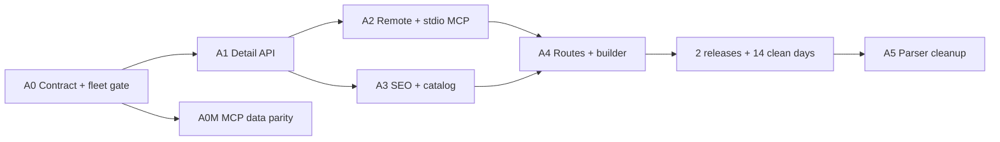

# Workflow — OmD v2 AST0 canonical reference pipeline

Date: 2026-07-11
Canonical roadmap: `spec/v2-execution.md` · `AST0` / Slice 2
Planning method: `source-command-sc-workflow` (deep, systematic, parallel lanes)

## Outcome

Every reference fact shown by the page, API, builder, MCP, JSON-LD, and sitemap must come from one typed, deterministic representation of `web/references/<id>/DESIGN.md`.

The first delivery unit deliberately adds the contract, parser, selectors, fixtures, and fleet gate without switching a public consumer. This separates a structural change from a truth-policy change and gives every later migration a measurable rollback point.

## Non-goals

- Rewriting the 400 canonical DESIGN.md files.
- Promoting references to Verified from timestamps alone.
- Adding invented UI defaults such as `#6366f1`, `Inter`, or `6px` when evidence is absent.
- Making live network checks a pull-request hard gate.
- Replacing raw DESIGN.md distribution; CLI and local MCP must remain useful offline.

## Current-state diagnosis

The repository has one canonical raw source but several independent interpretations:

- canonical detail route: `web/src/app/design-systems/[id]/page.tsx`
- legacy detail route: `web/src/app/reference/[id]/page.tsx`
- detail/list APIs: `web/src/app/api/references/**`
- token preview and builder: `web/src/lib/extract-tokens.ts` plus builder consumers
- font resolution: `web/src/lib/font-registry.ts`
- remote MCP: `web/src/lib/mcp/catalog.ts`
- local stdio MCP: `packages/mcp/src/data.ts`
- SEO, JSON-LD, sitemap, and collection copy

The same field can therefore disagree by surface. Toss is the first parity fixture: its brand-asset color is `primary_color: #0064ff`, while its canonical UI primary token is `tokens.colors.primary: #3182f6`. These are different facts and must not be collapsed.

## Canonical contract

`ReferenceAst` is a loss-aware normalized view, not another source of truth. It must retain raw markdown and claim provenance while exposing typed identity, quality, token, and section data.

Core rules:

1. `web/references/<id>/DESIGN.md` remains the only authored reference source.
2. Generated quality status is joined by ID and is authoritative for public status.
3. Brand asset color and UI primary color are separate fields.
4. Values retain `claimPath`, `origin`, and confidence.
5. Missing data remains `null`; consumer-specific fallbacks live outside the AST.
6. Derived display values use shared selectors rather than being duplicated in the AST.
7. Normalization is deterministic and has no filesystem or network dependency.

Initial selectors:

- `selectPrimaryColor`: `colors.primary → colors.brand → brandColor → null`
- `selectCanvas`: `canvas → background → surface → null`
- `selectForeground`: `foreground → heading → ink → body → null`
- `selectUiFont`: `ui → sans → body → default → base → null`
- `selectDefaultRadius`: `base → md → first semantic radius → null`

## Delivery plan

| ID | Status | Work | Acceptance / evidence | Rollback |
|---|---|---|---|---|
| AST0-A0 | ✅ | Add pure typed AST, normalizer, selectors, fixture tests, and 400-reference fleet gate. No public consumer switch. | 2026-07-11: Toss/Baemin/Dcard/synthetic contracts pass; 400/400 parse; registry/quality/AST ID sets match; deterministic output; 665 Web tests + typecheck + production build pass. | Delete the additive module/tests; no runtime behavior changed. |
| AST0-A0M | ⬜ | Repair local MCP data sync ordering and pin raw/hash/count parity to the 400 canonical files. | A clean checkout runs MCP tests without relying on stale bundled files; exact ID/content parity. | Restore prior sync step; raw canonical files remain untouched. |
| AST0-A1 | ✅ | Add server repository and parity adapter; switch detail API first behind `REFERENCE_AST_V2`. | 2026-07-11: default-on AST v1 contract includes provenance/quality/parity; Toss/Baemin/Dcard/404 and `0|false|off` rollback pass; Web 672/672 + typecheck + production build pass. | Set `REFERENCE_AST_V2=0`, `false`, or `off` for the exact legacy payload. |
| AST0-A2 | ⬜ | Switch remote and stdio MCP to the portable generated AST while continuing to ship raw DESIGN.md. | Remote/local MCP match API for primary/canvas/font/radius/status; offline CLI contract preserved. | MCP dual-read selects legacy adapter. |
| AST0-A3 | ⬜ | Switch JSON-LD, sitemap, catalog, and collection status/count copy. | 400 discoverable IDs; quality badges come only from generated manifest; SEO fields match API. | Per-consumer flag or legacy adapter. |
| AST0-A4 | ⬜ | Switch canonical and legacy detail routes, preview/token sheet, font resolver, and builder. | Both routes and builder share selectors; primary/radius/font/status parity is 100%; mobile/export smoke tests pass. | Per-consumer flag. |
| AST0-A5 | ⬜ | Remove duplicate regex parsers after two releases and 14 clean measurement days. | Parity diff is zero for the observation window; no legacy imports remain; full build/test green. | Revert cleanup commit; additive AST fields remain compatible. |

## Parallel lanes and dependencies

- Contract lane owns schema, parser, selectors, fixtures, and versioning.
- Consumer lane migrates one boundary at a time, beginning with the detail API.
- Distribution lane owns raw/AST bundle parity across root CLI, remote MCP, and stdio MCP.
- Measurement lane records parity diffs and enables hard gates only after each consumer switches.

## Test and release gates

### AST0-A0 hard gates

- Unit: structured token precedence, provenance, null behavior, numeric radius normalization, malformed input.
- Fixtures: Toss, Baemin, Dcard, plus synthetic no-token and malformed documents.
- Fleet: all 400 canonical references parse; registry, quality manifest, and AST ID sets are equal.
- Fleet: no structured component names or counts are lost.
- Determinism: the same input produces the same serialized AST.
- Existing Web tests and TypeScript check remain green.

### Consumer migration gates

- Before migration: old/new differences are reported but do not fail the build.
- After a consumer switches: primary, canvas, font, radius, quality status, and evidence date parity become hard failures for that consumer.
- Quality manifest always wins status disagreements.
- Network availability remains nightly/advisory.

### Cleanup gate

- Two successful releases.
- Fourteen clean measurement days.
- Zero unexplained parity differences.
- No runtime import of the duplicated regex parsers being removed.

## Completed first implementation task

`AST0-A0` was completed on 2026-07-11:

1. Create the typed reference AST and pure normalization boundary under `web/src/lib/references/`.
2. Add shared selectors that return `null` rather than invented defaults.
3. Lock Toss brand/UI color separation, Baemin typography roles, Dcard radius safety, and synthetic fallback behavior.
4. Add a fleet test over the 400 canonical documents and generated quality manifest.
5. Focused tests (7/7), the full Web suite (665/665), TypeScript, targeted ESLint, and the 1,274-page production build passed.

The next task is `AST0-A0M`: make local MCP data sync deterministic and pin canonical raw ID/hash/count parity before `AST0-A2` switches remote and stdio MCP consumers.
