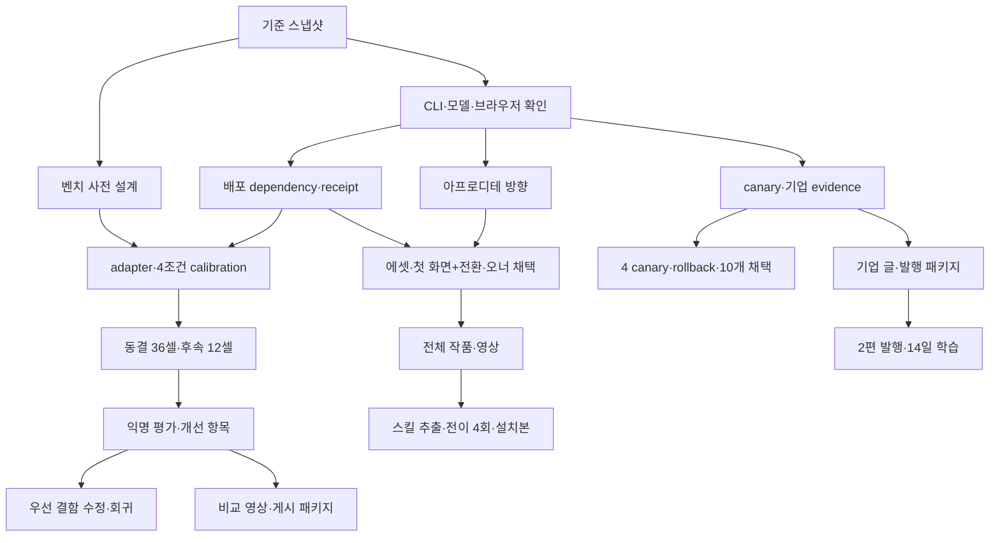

# OMD 실행 계획 — 5개 트랙과 모델 배치

> 2026-09-08 갱신: 현재 90분 실행의 모델 배치는 사용자 지시로 Astra·Sol 구현까지 확장됐다. 이 문서 아래의 Grok/Opus 및 Astra 기획 전용 배치는 이전 계획 기록이다. 현재 결과와 다음 순서는 [GPT90 실행 계획](OMD_GPT90_PLAN_2026-09-08.md), [후속 로드맵](OMD_NEXT_ROADMAP_2026-09-08.md), [CURRENT_STATE](CURRENT_STATE.md)를 우선한다. 벤치의 기존 동결 epoch는 소급 변경하지 않는다.

작성: 2026-09-07. 상태: **F-0~3 기반 인수 완료, goal 활성. A-0와 B-0/B-1 실행 중; 실제 벤치 배치는 admission 전**.
이번 사용자 지시가 모델 선택의 기준이다: Grok 4.6=Grok Build CLI,
Opus 5=Claude Code CLI, Sol=Codex. Astra/Fable 5.1은 필요한 기획 검토에만 사용한다.
기존 감사·미커밋 수정 사항은 보존하고, 작업을 시작할 때 기준 스냅샷을 만든다.

선행 문서: `reviews/omd-restart-audit-2026-09-07.md`,
`BENCHMARK_RESTART_2026-09-07.md`, `APHRODITE_REBOOT_2026-09-07.md`.
작업별 담당·의존성·완료 조건은 `OMD_EXECUTION_BOARD_2026-09-07.json`으로 함께 관리한다.
이 문서와 보드는 스케줄러가 아니며 모델 호출을 시작하지 않는다.

## 1. 전체 운영 결정

**5개 트랙을 만들되 일반 개발 프로세스는 평상시 최대 3개만 운영한다.**
트랙 수와 동시 실행 수를 분리한다. 초기에는 Sol 1개 + Opus 1개를 유지하고,
에셋 작업이나 벤치 슬롯에서 Grok 1개를 추가한다.
**벤치는 별도 슬롯 정책: Grok 4개 조건을 동시에 실행하고 공유 브라우저만 1개씩 사용한다.**
이는 사용자의 후속 지시를 반영한 변경이며 아래의 과거 직렬/고정 에셋 가정을 대체한다.

| 트랙 | 목표 | 주 담당 | 첫 완료 포인트 | 트랙의 완료 포인트 |
|---|---|---|---|---|
| F — 실행·배포 기반 | 설치본과 측정 결과를 신뢰할 수 있게 | Sol | CLI/브라우저 preflight, 도구 dependency/경로 해결, 해시 receipt | 배포 fixture 전부 검증, 설치본 smoke/doctor/mirror PASS |
| B — 벤치·개선 | 에셋 기획·생성부터 최종 UI까지 스킬의 기여 측정 | Sol 설계/러너, Grok 4조건 병렬 | 도구 동등 접근·브라우저 직렬화·4조건 smoke와 동결 | 에셋/페이지 별도 평가, 36개 첫 제출+12개 후속 원장, 결함 수정/회귀, 비교 영상 |
| A — 아프로디테 | 실제로 공개할 한 작품과 재사용 제작 경로 | Opus 제작, Grok 에셋, Sol 통합 | 첫 화면+첫 전환을 실제로 보고 방향 채택 | 플래그십+전이 실험 4회+설치본 재생산+영상/소스 |
| D — Core·카탈로그 | staged 문서를 실제 제품에 채택 | Sol 구현, Opus 의미 검토 | 4종 canary의 의미/소비자 차이표 | 4 canary 채택·rollback, 후속 10개 소배치와 소비자 회귀 검증 |
| E — 콘텐츠·유입 | 증거가 있는 콘텐츠를 실제 handoff로 연결 | Opus 집필, Sol 발행/측정 | 국내 기업 해석 글 1편의 발행 패키지 | 2편 ko/en 발행·한 번의 측정/수정 주기 |

우승하지 못한 벤치도 B의 정상적인 완료 결과다. A에서 작품 한 장이 통과한 것과
스킬 전체가 통과한 것은 다르다. E의 발행 완료와 트래픽 효과 확인도 별도 상태로 기록한다.

## 2. 모델별 역할과 경로

| 모델 | 맡길 일 | 기본 effort | 맡기지 않을 일 |
|---|---|---|---|
| **Sol** | CLI/TypeScript/테스트, bench adapter·통계, Core consumer, package integration, 공통 작업판 관리 | `high` | 자기 코드의 의미 보존을 혼자 최종 승인, 미적 우승 판정 |
| **Opus 5** | 아프로디테 페이지 제작·카피, Core의 서사/출처/의미 검토, 한국어 집필·영어 adaptation | `high` | 모든 단계를 매번 장문 재기획, 자신이 만든 페이지의 최종 미적 승인 |
| **Grok 4.6** | 4조건에 공통으로 사용하는 모델, image/video probe·생성, 필요한 출처 탐색 | `high` | 자신이 생성한 벤치 결과의 주관적 순위 결정 |
| **Astra 또는 Fable 5.1 중 하나** | 초기에 제작 방향/벤치 질문 1회 검토. A가 두 번 막히면 실패 원인 재기획 1회 | 계획 세션에서 명시 | 일상 구현·일괄 리뷰·bench 생성·매 라운드 심사 |

이는 작업 분담의 초기 가설이다. Opus가 미적으로 우월하다거나 Sol이 더 싸다는
미측정 주장을 근거로 삼지 않는다. 실제 산출과 시간으로 역할을 조정한다.
다른 모델로 바꿀 때 작업 단위 경계에서 인계한다. 벤치 도중 모델 교체는 금지한다.

### 현재 CLI를 읽어 확인한 것

- Grok `1.0.13`, Claude Code `2.1.258`, Codex `0.146.1` 실행 파일이 있다.
- Grok에는 `--prompt-file`, `--cwd`, `--model`, `--reasoning-effort`, `--max-turns`,
  `--output-format`, `--no-subagents`가 있다. headless `--worktree`는 worktree를 만들지 않는다.
- Claude에는 `-p`, `--model`, `--effort`, `--output-format`, 설정/도구 제한 기능이 있다.
  `opus`는 alias이므로 **실제 반환 model ID가 Opus 5인지 확인 후 고정**한다.
  구형 runner의 기본 `claude-opus-4-8`을 그대로 사용하지 않는다.
- Sol은 `codex exec -m gpt-5.6-sol -c model_reasoning_effort='"high"'` 경로를 사용한다.
- Grok 구형 runner의 `--no-memory`, `--no-auto-update`는 현재 help에 나타나지 않는다.
  두 옵션과 `--help`를 함께 준 명령은 exit 0이었다. 따라서 “삭제됐다”거나
  “현재도 격리가 작동한다”고 단정하지 않고 실제 config discovery/격리를 시험한다.
- `docs/PROVIDER_ROUTING_POLICY.md`의 Sol 퇴역 문구와 machine policy의 Sol 허용이 다르다.
  **이번 사용자 지시로 Sol 사용 범위는 정해졌다.** F-1에서 현행 문서/guard를 일치시키며
  과거 동결 epoch의 정책은 소급 변경하지 않는다. 같은 허용 여부를 다시 질문하지 않는다.

F-1이 CLI flags, model_requested/model_reported, version, effort, 인증 성공 여부,
도구 허용 범위를 담은 `runtime-preflight.json`을 만든다. model ID를 모델의 자기소개로 확인하지 않는다.
도움말 확인은 끝났지만 실제 인증·한도·미디어 성공 probe는 아직 실행하지 않았다.

**후속 실행 점검으로 갱신:** [브라우저·인증 점검](reviews/runtime-access-preflight-2026-09-07.md)에서
Opus5/Grok4.6 marker 호출과 Computer Use Chrome/Grok Imagine 웹 로그인을 확인했다.
Claude의 sandbox auth false는 host keychain 접근 경로에서는 true였다. 재로그인 문제로 취급하지 않는다.
Grok 임시 프로필+명시적 allowlist의 실제 init은 skills0/tools1, invocation0이었다.
후속 [워커 점검](reviews/execution-readiness-2026-09-07.md)에서 Opus/Grok 파일 작업과 Grok4개
동시 파일 작업도 PASS. 미디어 포함4조건·전체 격리/broker 검증은 남아 있다. iTerm2의 Computer Use 제어는 도구 정책상 불가다.

후속 읽기 전용 probe에서는 temp cwd에서도 global discovery가 남는 것을 확인했다.
문서화된 `GROK_HOME` 분리 후에도 호환 경로의 스킬122/훅14/MCP6개가 발견됐다.
`reviews/evidence/grok-parallel-preflight-2026-09-07/discovery-receipt.json`에 근거를 남겼다.
이는 실제 headless 주입 여부까지 증명한 것은 아니며, F-1의 negative isolation 검증이 더 필요하다.

## 3. F — 실행·배포 기반

| ID | 실행 | 산출/완료 조건 |
|---|---|---|
| F-0 | Sol: 이전 미커밋 수정과 사용자 연구 변경을 구분해 기준 snapshot. 트랙별 checkout/출력 폴더 준비 | source commit+patch SHA, 소유 파일표, 원본 보존. 실행 중인 미완료 작업은 완료로 표시하지 않음 |
| F-1 | Sol: 세 CLI의 기본 워커 인수/결과 회수·모델 귀속·작업 공간·브라우저 연결·중단/재개 probe | 입력 파일→출력 파일→종료/수집, model ID, 기본 브라우저 연결 확인. 벤치 전용 broker/전체 격리는 B-1에서 구현·검증 |
| F-2 | Sol: Aphrodite 도구·reference·license 배포 범위와 설치본 경로 해결 | 별도 임시 consumer에서 font/reference/check 접근. 저장소 경로·개발 node_modules 없이 실행 |
| F-3 | Sol: source/brief/assets/output/checker SHA receipt, gate별 기능/스타일 분류 | touch/checkout만으로 fresh가 되지 않음. 스타일 선택이 파손 PASS를 대신하지 않고, hard failure를 warn으로 숨기지 않음 |
| F-4 | Grok/Opus 생성, Sol 검증: 기존 landing/autopilot fixture 재생성·karrot 2칸 채우기 | 현재 출하할 스킬의 6칸 모두 receipt 연결·hard gate PASS. 부족한 칸을 삭제하거나 수동 채운 파일을 생성 성과로 쓰지 않음 |

**F-1~3 완료 = 측정 가능한 기준선**, **F-4 완료 = 기본 경로의 품질 증거**다.
B는 F-4의 예쁜 결과를 기다리지 않는다. 설치/실행이 가능하면 부족한 결과도 평가해야 한다.
단, B에 사용한 source snapshot은 F-4에서 발견한 수정과 분리해 동결한다.

F-3은 모든 품질 검사를 새로 만드는 작업이 아니다. 기존 checker의 강제 범위와 receipt를
정리한다. 카피/이미지의 의미 일치를 정규식 PASS 하나로 대체하지 않는다.

F-1에서 B-1의 broker 완성을 기다리는 의존성은 만들지 않는다. F는 일반 워커와 설치/검증
기반을 열고, B-1/B-2가 벤치 전용 격리·미디어·브라우저·동시 실행을 최종 승인한다.
A-0/D-0의 브리프·근거 정리는 B의 전체 실행 준비를 기다릴 필요가 없다.

## 4. B — 순정 비교와 개선

### 첫 회차: Grok 4.6 하나로 4조건 비교

`no-skill / UIUX Pro Max / Hallmark / OMD portable`를 모두 같은 Grok Build runtime,
같은 브리프·사실 자료·사용 가능한 도구·effort·예산에서 실행한다.
**완성된 공통 에셋 세트는 제공하지 않는다. 각 조건이 자기 스킬에 따라 에셋을 기획·생성·선택한다.**
이는 **에셋 제작을 포함한 단일 에이전트의 스킬 기여**다.
OMD 전체 orchestration의 최대 성능이라는 문구를 붙이지 않는다.
새 세션/격리된 환경을 쓰고, no-skill에 OMD/사용자 전역 스킬·대화가 흘러들지 않았는지 검증한다.

순정에도 같은 이미지·영상·브라우저·로컬 제작 도구의 중립적인 사용 설명을 제공한다.
도구 접근 권한을 같게 하며, 고른 매체·도구·생성 장수·프롬프트를 같게 강제하지 않는다.
브랜드 과제의 공식 로고/원문 같은 필수 사실 자료만 공통 입력으로 허용한다.
이미지·영상 모델은 도구 backend로 기록하고 host Grok 모델과 구분한다.
현재 검증 가능한 도구 inventory를 모든 조건에 동일하게 제공한 뒤 동결하며,
한 조건에만 수동 프롬프트 보정·추가 에셋·다른 조건의 결과를 공급하지 않는다.

| ID | 실행 | 완료 조건 |
|---|---|---|
| B-0 | Sol 초안, Opus 방법 검토 1회: 과제·arm·에셋/페이지 평가·예산·실패 규칙 결정 | 3과제+별도 calibration 과제, 공통 도구 inventory·권한, 자유 생성/귀속·브라우저 대기 규칙 |
| B-1 | Sol: 기존 UI-Resolve adapter 및 도구 broker 연결 | 올바른 activation, host child model 금지, 4조건 동시 실행/격리, 공유 브라우저 상호 배제·취소·공정 큐·귀속 검사 |
| B-2 | Grok: calibration 1과제×4조건 병렬. Sol: 실행/에셋 귀속 검사 | 모든 조건의 도구 접근·browser lease·시간 계측 검증. 방법 변경 후 새 manifest 동결 |
| B-3 | Grok: 같은 과제·반복의 4조건을 묶어 병렬, 3과제×3그룹=36개 첫 제출 | 모든 셀 terminal, 에셋 시도/선택/사용 원장, browser 대기/사용 기록. 좋은 결과만 대체 실행하지 않음 |
| B-4 | Grok: 기능 UI의 12개 결과에 동일 후속 변경 | 이전 산출물·세션 연속성 조건 고정, 추가 12개 기록. 최초 결과 실패로 후속 불가한 셀도 lineage에 남김 |
| B-5 | Sol 집계, 실제 사람 익명 선택, Opus 결함 사유 검토 | 에셋만의 품질/페이지에서의 활용/기능/비용을 별도 보고, 전체 gallery와 생성 이력, 개선 항목 최대 5개 |
| B-6 | Sol: 우선 결함 최대 3개 수정, Opus: 변경 스킬의 의도 검토 | 각 결함의 실패 재현→수정→실패 과제 회귀+보지 않은 과제 검증. 신규 epoch에 기록. 결함이 없으면 근거와 함께 해당 없음 |
| B-7 | Sol: 실제 브라우저 영상 capture/편집, Opus: 설명·게시문 | 30~45초 비교 영상 1개+10~15초 짧은 컷 2개, 조건/원본/전체 gallery 링크 포함. 동등한 viewport·재생속도, 실제 동작 사용 |

**기본 실행량: calibration 4 + 첫 제출 36 + 후속 12 = 52개 예정 셀.**
calibration은 성적 분모에 넣지 않는다. 메타데이터 probe·평가·후속 개선은 별도 집계한다.
B-6의 회귀/새 과제 실행과 선택 실험도 이 52셀 밖이다. B-5에서 결함별 검증 행렬을
정한 뒤 실행량을 추가한다. B-7은 B-5의 원본 결과로 만들 수 있어 B-6과 독립적으로 진행한다.
수정 후 결과를 영상에 쓰면 revision과 추가 입력/수정 여부를 별도 표시한다.

초기 상한 제안은 첫 제출/calibration 한 셀 active 20분, 후속 active 10분, host turn 30이다.
active 시간은 생성·내부 수정·실제 도구 사용·검증을 포함하며 broker가 측정한 공유 브라우저
큐 대기 중 실제 셀이 중단된 구간만 제외한다. 대기 중 코딩 등 다른 작업을 계속하면 active다.
모델이 대기를 자가 신고해 예산을 늘릴 수 없게 한다.
큐 대기 상한과 전체 elapsed 상한은 별도로 두고 calibration에서 모든 조건에 공통으로 동결한다.
에셋 생성까지 이 예산에 맞는지 확인하기 전에는 20분을 확정 상한으로 사용하지 않는다.
기존 15시간 20분은 이 제안의 **셀 active 상한 합계**이며 병렬 배치의 소요 시간 예측이 아니다.
4개 병렬이므로 4배 빨라진다고 약속하지 않는다. 브라우저 대기와 생성 서비스 병목은 별도 측정한다.
예산 소진/실행 실패는 품질 점수와 별도 terminal 사유로 공개하며, 과거 epoch의 분모 규칙과 섞지 않는다.

### 생성 에셋도 독립 평가

- 생성 프롬프트·참조 입력·도구/미디어 모델·시도/실패·원본/선택/실제 사용 파일 SHA를 기록한다.
  버린 시도를 삭제하지 않고 선택 이유·사용 위치를 남긴다. UI-only 판단도 결과로 허용한다.
- 익명 에셋 패킷에서는 브리프 적합성, 세트 일관성, 눈에 보이는 결함, 의미 있는 차별성을 평가한다.
  영상이면 장면/시간 연속성도 본다. 장수가 많거나 영상이 있다는 이유로 가점을 주지 않는다.
- 페이지 패킷에서는 에셋 배치·카피와의 의미 일치·가독성·동작·로딩/모션을 별도로 평가한다.
  에셋과 페이지는 독립적으로 익명화하고 에셋 패킷을 먼저 고정한다. 에셋이 없는 UI에는 해당 없음을
  허용하되 과제에서 요구한 에셋이 누락된 경우에는 실패를 기록한다.
- 에셋 평가와 페이지 평가의 관계는 관측 결과다. 어느 쪽이 개선의 원인인지는 별도 통제 실험 없이 단정하지 않는다.
- 고정 에셋 비교가 원인 분리에 필요해지면 별도 선택 회차로 등록한다. 현재 기본 52셀에 섞지 않는다.

토큰·USD는 provider가 반환한 수치를 기록한다. 동일한 `high`가 다른 모델에서 동일 계산량이라는
가정은 하지 않는다. 구독/API 비용 경로를 probe하고, 비용 상한을 실제로 강제할 수 없으면
금액 hard cap이라고 쓰지 않는다. 모델별 가격표를 추정해 총비용을 확정하지 않는다.

사람 평가는 5명을 목표로 한다. UI/디자인 경험자와 대상 사용자 관점을 섞고 reviewer별
독립 선택을 받는다. 소표본 선택률을 통계적 우월성으로 확대하지 않는다.
사람 평가가 부족하면 기계/비용 결과까지 완료, 미적 결론은 `human-review-pending`으로 둔다.

### 두 번째 회차는 결과에 따라 선택

- OMD의 반복되는 결함 → Sol이 최대 5개로 묶어 수정 → 실패 과제 회귀 + 보지 않은 과제 검증.
  새 결과는 새 revision/epoch에 기록한다.
- “전체 CLI/하네스가 낫다”는 주장이 필요 → 같은 Opus 5 host에서 4조건의 **native harness**
  1과제×2회=8셀 사전 등록. 모든 조건에 같은 기본 도구/총시간을 허용하고 각 제품의 정상
  orchestration을 쓴다. 하위 모델까지 Opus 5로 고정 가능한 경우만 해당 비교로 인정한다.
- Grok 밖에서도 스킬 기여가 유지되는지 보려면 별도 **Opus 단일 에이전트 transfer 8셀**을
  실행한다. 앞의 native 8셀과 다른 질문이며 같은 숫자로 합치지 않는다.

두 선택 실험을 초기 필수 52셀에 넣지 않는다. Grok이 quota에 막혀도 본실험의 나머지를
Opus/Sol로 채우지 않는다. 같은 runtime/model로 재개할 수 없으면 해당 회차를 닫는다.

## 5. A — 아프로디테 작품 → 하네스

| ID | 담당/순서 | 완료 조건 |
|---|---|---|
| A-0 | Opus: 제품 약속·한 장면·사용자 행동·핵심 전환을 1장 브리프로. 필요 시 Astra/Fable 기획 검토 1회 | 유지/변경할 결정과 가설 명시. 기존 DESIGN 범위 또는 구체적 토큰 변경안 확정 |
| A-1 | Grok: 작은 에셋 probe. Opus: 첫 화면+첫 전환 구현 | 참고 이미지 기반 장면 연속성 확인, 실제 움직이는 desktop/mobile 구간. 임시 빈 슬롯 상태로 방향 채택 안 함 |
| A-2 | 오너: r2와 후보를 같은 환경에서 비교. Sol: 기능 확인 | “이 방향으로 전체 페이지를 완성하자” 판단과 사유 기록. 점수만 받고 해석을 모델이 발명하지 않음 |
| A-3 | Opus: 전체 페이지·카피·실제 CTA 완성. Sol: 기능/성능 검증, Grok: 필요한 나머지 에셋 | 실제 페이지 hard defect 0, 카피/이미지/제품 약속 일치, 모바일/키보드/reduced-motion, 시연용 작품으로 오너 채택 |
| A-4 | Opus 작업 기록 추출, Sol 배포 스킬/설치 통합 | 짧은 재현 절차·조건부 매체 선택·편집 검토. 특정 색/장수/효과 의무로 일반화하지 않음 |
| A-5 | 새 Opus 세션: 다른 업종 2개×2회=4회, Sol QA | creator의 수동 보정 없이 배포 스킬로 생성. 4/4 핵심 동작 PASS, 같은 템플릿 복제 여부와 사람 선호 기록 |
| A-6 | Sol: Aphrodite fixture/명시적 호출/doctor/docs/receipt 통합 | 새 consumer에서 재생산, source/asset/결과와 영상 연결, release checks PASS |

첫 에셋 probe는 스틸 최대 6개+짧은 클립 최대 2개를 **실험 예산**으로 쓴다.
완성 페이지가 가져야 할 에셋 개수 규칙이 아니다. 같은 장면 유지가 두 번 실패하면
프롬프트를 수십 번 늘리지 않고 Blender의 동일 scene 조명/카메라 렌더를 검토한다.
Blender 스크립트는 Sol이 맡고 Opus가 프레임의 시각적 선택을 담당한다.

A-1/A-2는 최초 후보와 집중 수정 1회, 합계 2회까지만 같은 방향을 반복한다.
둘 다 채택되지 않으면 Astra **또는** Fable에게 가설 재검토 1회를 요청한다.
그 결과로 새 방향을 선택하거나 중단 결과를 남긴다. 자동으로 r11~r20을 계속 만들지 않는다.

**A-3 = 공개할 작품**, **A-6 = 출하할 제작 경로**다. A-3 시점의 영상은 작품 시연으로
사용할 수 있지만, A-5를 거치기 전에는 업종 무관 성능을 주장하지 않는다.
숫자로 “90점”을 강제하는 대신 오너의 작품 채택과 외부 선택/사유를 증거로 남긴다.

## 6. D — Core v2의 제품 채택

| ID | 담당/순서 | 완료 조건 |
|---|---|---|
| D-0 | Opus: existing staged/정본 inventory, 4종 canary 선택 | 깊은 토큰·서사 중심·결측·특이 구조를 대표. 각 파일/출처 대응표. E의 첫 기업 evidence 재사용 |
| D-1 | Sol: consumer parity와 catalog 채택 경로 | 원본→staged→Builder/export/raw/CLI 값·서사·unknown 대응, 발명/손실 0 |
| D-2 | Sol 채택/rollback, Opus 의미 diff 확인 1회 | 4종 모두 Home→Builder→선택→override→preview→export 통과, 실제 이전 상태 복원과 재채택 |
| D-3 | Sol 배치/게이트, Opus 의미 검토 | 추가 10개만 채택·전수 검증. 손실/오귀속 발견 시 그 배치 중단·격리 |

Toss/Karrot/29CM/MakinaRocks 등 기존 자료가 있는 후보에서 시작하되,
분류와 증거를 확인한 뒤 D-0에서 정확한 네 ID를 확정한다. 후보명을 분류 사실로 쓰지 않는다.
이번 트랙 완료는 **14개 소비자 검증 채택**이다. 나머지 440 일괄 이관·600개 확장은 다음 계획이다.
일괄 writer가 열리기 전 정본은 직접 덮어쓰지 않는다. 저작 정본은 `web/references/`다.

## 7. E — 큐레이션과 유입

| ID | 담당/순서 | 완료 조건 |
|---|---|---|
| E-0 | Opus: 첫 기업 source dossier·독자 질문·주장 선정 | 공식 발표/라이브 관찰/OMD 해석/창작 제안을 구별. D-0 evidence 재사용 |
| E-1 | Opus: 기업 해석 글 ko→en, 실제 적용 예. Sol: 출처/명령 검수 | 제목·본문·이미지·출처·하나의 handoff 동선까지 포함한 패키지 |
| E-2 | Sol: 현재 블로그 라우트/SEO/링크/analytics 검증. Opus: 실제 페이지 교정 | 발행 전 preview·모바일·locale·canonical·event 확인. 사람이 최종 확인할 준비 완료 |
| E-3 | 게시 후 Sol 지표 수집, Opus 후속 글/수정 | 기업 글+실제 Core 파일로 설명하는 실용 글 총 2편 ko/en, 최소 14 complete days의 유입/handoff 읽기 및 후속 수정 1회 |

E-1/E-2는 D의 대량 채택이나 A/B 완성을 기다리지 않는다. 현행 verified 자료로도
해석 글은 만들 수 있다. 아직 채택되지 않은 Core 기능을 이미 배포됐다고 쓰지만 않으면 된다.
벤치 영상·Aphrodite 영상은 완성될 때 콘텐츠 큐에 추가하며 첫 글의 필수 dependency로 두지 않는다.

첫 글의 기업은 D-0에서 근거가 가장 온전한 국내 기업을 선택한다. 사이트의 명성이나
조회수 예상만으로 선택하지 않는다. 기존 출처 재검증은 집필 전에 한다.

실제 게시·배포는 완성된 발행 패키지를 검토한 뒤 진행한다. 조회수 보장은 완료 조건이 아니다.
14일 뒤 표본이 부족해도 관측 건수와 불확실성, 다음 실험을 쓰면 학습 단계는 완료할 수 있다.
글을 썼다는 이유로 성장했다고 판정하지 않는다.

## 8. 의존성과 병렬 실행

**동시에 할 수 있는 것**

- Sol이 실행/패키징을 고치는 동안 Opus가 A 방향·D evidence·E 브리프를 순서대로 준비.
- Grok이 에셋을 생성하는 동안 Opus가 확정된 골격을 구현하고 Sol이 Core parity 작업.
- 다른 사람이 시각 결과를 보는 동안 기술 수정·문서·발행 준비 진행.
- D 소비자 구현과 E 집필: 원본을 공유하되 E는 D 변경본을 공식 사실로 승격하지 않음.

**순서대로 해야 하는 것**

- 변경 소유자가 같은 파일을 편집하는 작업, `npm build`와 설치 mirror/registry 생성은 직렬.
- asset anchor 선택 → 참조 변형 → 페이지 완성. scene이 계속 바뀌는 상태로 본문 전체를 제작하지 않음.
- protocol freeze → 본실험 → 결과 해석 → 스킬 변경. 평가 중 source 변경 금지.
- 원본 의미 inventory → consumer parity → 채택 → rollback → 배치 확대.
- 본문 사실 확정 → 영어 adaptation → 실제 라우트 QA → 발행.

**Grok 4조건 병렬, 공유 브라우저 1슬롯**으로 운영한다.
같은 과제·반복의 네 조건은 각자의 workspace/session/assets에서 동시 실행한다.
각 그룹의 네 셀이 terminal에 도달한 뒤 다음 그룹을 시작한다. 프로세스 시작 순서는 사전에
순환 배치하고 실제 시작 시각/브라우저 요청 순서를 남긴다. 먼저 시작한 조건을 계속 우선하지 않는다.
외부 asset API나 독립 로컬 제작은 병렬로 허용하며, 공유 browser의 탐색·생성 조작·다운로드·
검증 capture 구간만 broker를 통해 순차 진행한다. 단순히 프롬프트로 차례를 부탁하는 것은 구현으로 인정하지 않는다.

- browser 요청은 FIFO, 한 번에 한 transaction. request/acquire/release/cancel과 owner를 기록한다.
  기다리는 조건은 다른 조건의 탭·프롬프트·결과·다운로드를 볼 수 없게 해야 한다.
- 오래 걸리는 이미지/영상 생성은 서비스가 안정적인 job ID를 제공하고 결과를 셀별로 다시 받을 수 있을 때만
  브라우저를 반환하고 나중에 수거한다. 그렇지 않으면 해당 transaction 동안 점유한다.
- timeout/crash 시 실제 작업의 종료/격리를 확인하기 전에는 lease를 다음 조건에 넘기지 않는다.
  stale lock을 시간만 보고 지우지 않는다. 취소와 재개 시 동일 셀의 귀속을 유지한다.
- 측정은 `elapsed / broker_queue_wait / active / browser_use / media_service_wait / provider_cost`로 분리한다.
  이 중 media_service_wait 등은 중첩 가능한 세부 구간이므로 모두 더해 총시간이라고 하지 않는다.
  병렬 실행의 latency 비교는 **descriptive-only**다. 순수 모델 속도 순위를 주장하려면 별도 직렬 회차가 필요하다.
- provider rate limit/머신 부담을 calibration에서 확인한다. 본실험 중 일부 조건만 동시성/도구를 바꾸지 않는다.
  공통 조건 변경이 필요하면 현 회차를 보존하고 새 설정을 동결한다.

관련 없는 A/D/E 모델 작업을 같은 머신에 추가로 과밀 배치하지 않는다. 공통 파일 통합은 계속 직렬이다.

## 9. 파일 소유권과 실행 단위

| 작업 공간 | 소유 |
|---|---|
| F: `src/cli`, 설치·quality/receipt helper, package files | Sol |
| B: 새 benchmark epoch/config/adapters/records | Sol; Grok은 지정된 셀 sandbox에만 쓰기 |
| A: 새로운 run dir의 HTML/assets/trace | Opus; Grok assets 하위 폴더; Sol은 명시적 통합 patch |
| D: catalog consumer·채택 tooling | Sol; Opus review 문서만. canonical 변경은 채택 단계에서만 |
| E: 새 blog slug ko/en | Opus; Sol은 routing/metadata/analytics와 검증 |
| 공통 package.json·generated data·mirror·CURRENT_STATE | **Sol 통합 담당 한 명** |

실행 시 `codex/track-foundation`, `codex/track-benchmark`, `codex/track-aphrodite`,
`codex/track-core`, `codex/track-content` 같은 별도 branch/checkout을 사용한다.
벤치가 parent repo의 AGENTS/skills를 읽지 않도록 checkout 분리만으로 만족하지 않고 환경을 검증한다.
여러 CLI가 main에서 동시에 수정하거나 커밋하지 않는다. 독립 파일이어도 실제 병합은 한 번에 하나다.
계획 단계에서는 branch/작업 프로세스를 만들지 않았다.

모든 실행 요청은 목적·입력 경로·수정 가능 파일·완료 산출·검증·시간 상한을 포함한다.
한 호출은 하나의 작업 ID 또는 그 ID의 작은 하위 단위만 맡긴다.
작업 시작 10분 안에 첫 산출/실패 원인을 기록하고, 장문 읽기만 1시간 계속하지 않는다.
구현 단위의 기본 wall 상한은 45분, evidence/집필 단위는 30분이다.
초과하면 partial 산출과 다음 파일을 남겨 분할한다. 벤치는 별도의 고정 상한을 따른다.

일반 개발은 같은 결함에 집중 수정 2회까지, 그 뒤 원인/범위를 재검토한다.
인증·quota 실패는 새 호출을 중단하고 상태를 남긴다. 작업용 모델 fallback은 명시적 인계로만,
벤치에는 fallback 0회. 과거 wave runner의 자동 Claude fallback은 이번 벤치에 연결하지 않는다.

## 10. 실행 순서와 예상 달력

아래는 Sol/Opus/Grok 각 한 실행 슬롯, 하루 6~8시간 운영을 가정한 **추정**이다.
사람 평가 대기·provider quota·미적 방향 재기획은 별도이며 출시일 보장이 아니다.

| 구간 | Sol | Opus | Grok/기타 | 얻는 결과 |
|---|---|---|---|---|
| 1~2일 | F-0~3, B-0/1 우선 | A-0, D-0, E-0 | runtime·asset 작은 probe | 실행 가능한 baseline, 제작 방향, 기업 근거 |
| 3~4일 | A 구간 QA, B-2 준비, F-4 검증 | A-1/3 우선, E-1 | 에셋·fixture 생성, calibration 전용 창 | 첫 움직이는 구간, 첫 글 preview, 벤치 동결 |
| 5~6일 | 벤치 관리·browser broker·결과 기록 | 별도 시간에 편집/사람 검토 대응 | B-3/4 Grok 4조건 병렬, browser만 직렬 | 에셋/36+12 결과와 실패 원장 |
| 7~10일 | B-5/7, D-1/2, A-4 통합을 순차 처리 | A-3 마감, D 의미 검토, E 보완 | 필요한 소량 에셋 | 작품/영상, 4 canary, 개선 항목, 첫 발행 패키지 |
| 11~15일 | A-5 QA→A-6, B-6, D-3, F-4 최종 gate를 순차 처리 | A-5 4회·E 두 번째 글 | 결함 회귀 슬롯, 선택 실험은 아직 예약 안 함 | 출하 후보, 14개 채택, 2편 콘텐츠 |
| 발행 후 14일 | E 측정·링크/유입 수정 | 읽힌/안 읽힌 부분 수정 | — | 한 번의 성장 학습 사이클 |

병목은 **Sol의 공통 코드 통합 슬롯과 사람의 A 방향 판단**이다.
11~15일 구간은 통합 작업의 대기열이다. B-6의 결함이 크면 CLI 결함 수정/회귀와 A 출하를
먼저 닫고 D-3의 후속 10개를 다음 구간으로 넘긴다. 15일 안에 모두 끝난다고 약속하지 않는다.
동시 모델을 늘리기 전에 작업 크기를 줄이고 해당 두 지점의 대기를 줄인다.
A 방향이 막혀도 B/D/E는 계속 진행한다. B가 우승 불명확이어도 A/CLI 출시를 막지 않는다.

## 11. 공개/출시 단위와 완료 판정

| 마일스톤 | 필요 조건 | 공개 가능한 것 |
|---|---|---|
| M0 신뢰 가능한 기준선 | F-1~3 | 내부 실행 준비. 품질 우위 주장 없음 |
| M1 첫 공개 콘텐츠 | A-3 또는 E-2 | 작품 시연 또는 기업 해석 글, 각자의 실제 범위 |
| M2 비교 공개 패키지 | B-5+B-7 | 전체 반복 결과와 조건, 제한된 비교 결론과 영상. OMD 우승은 필수 아님 |
| M2b 벤치 개선 완료 | B-6 | 수정한 결함과 새 revision의 검증 증거. 수정 전 비교 결과 보존 |
| M3 기본 CLI 출하 후보 | F-4+설치/build/test/mirror | 확인된 수정·현재 지원 경로. 미완료 Aphrodite 경로를 완성으로 홍보하지 않음 |
| M4 Aphrodite 출하 후보 | A-6+해당 RC에 대한 F-4 재확인 | 명시적 호출의 재현 가능한 preview/기능. 자동 라우팅은 별도 필요성 검토 |
| M5 Core 소배치 완료 | D-3 | 실제 채택된 14개와 확인된 소비자 동작 |
| M6 콘텐츠 학습 완료 | E-3 | 실제 유입/handoff 결과와 다음 수정. 트래픽 증가 보장 없음 |

모든 트랙이 끝나야 글 한 편을 내거나 패치를 낼 수 있는 구조로 만들지 않는다.
사용자에게 보여줄 판단 지점은 구체적 산출물에 둔다: A의 움직이는 구간,
최종 작품/비교 패키지, 실제 게시·배포 후보. 이미 허용된 모델·CLI 사용은 재승인받지 않는다.

## 12. 바로 시작할 작업 큐

1. **Sol / F-0 → F-1 → F-2 → F-3.** 마지막 감사 변경을 기준으로 실행 경로와 설치본을 닫는다.
2. **Opus / A-0 우선, D-0 → E-0 순.** 하나의 Opus 호출에 세 프로젝트를 함께 넣지 않는다.
3. **Grok / F-1 probe 후 A-1 asset probe.** 아직 52개 벤치 셀을 일괄 시작하지 않는다.
4. **Sol / B-0 → B-1 → B-2.** 최소 4조건의 실제 격리/activation을 확인한 뒤 본실험을 연다.

2026-09-07 후속: `benchmarks/ui-resolve-bench/config/asset-generation-four-arm-v0.1.json`과
`benchmarks/ui-resolve-bench/scripts/validate-asset-generation-contract.mjs`의 신규 계약/검증을 Sol로 구현했다.
17개 provider-zero 테스트와 draft 검증 PASS. calibration/main 진입은 실제 격리·도구·broker·예산 검증이 남아 닫혀 있다.
과거 `run-grok.mjs`의 네트워크/브라우저 차단 계약은 새 회차에 그대로 적용할 수 없으므로
새 adapter 연결과 broker 검증 전까지 기존 runner로 이 실험을 실행하지 않는다.

각 작업은 완료 증거를 보드에 붙인 다음 의존 작업을 연다. 새 세션·모델 교체·compact 후에도
`CURRENT_STATE → 이 계획 → 작업 ID` 순서로 이어받는다.
