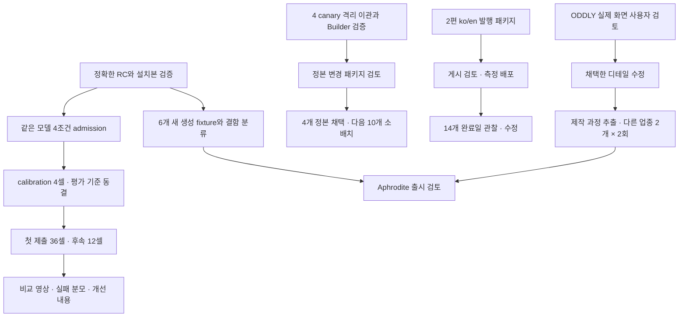

# 2026-09-08 이후 실행 로드맵

이 로드맵은 Astra·Sol 90분 스프린트에서 확보한 실제 코드와 검토본을 다음 출시 단위로 연결한다. 작업의 전체 완료와 이번 스프린트의 완료를 구분한다. 실행 상태는 `CURRENT_STATE.md`, 파일별 증거는 `.omd/execution/2026-09-08/sprint90/`에 둔다.

## 현재 출발점

| 트랙 | 확보한 것 | 아직 증명하지 않은 것 |
|---|---|---|
| ODDLY / Aphrodite | 실제 3D, 네 장면, 로컬 노트 저장, 데스크톱·모바일 스크롤 영상 | 사용자 미적 채택, 다른 프로젝트의 재현성 |
| DESIGN.md Core | 의미 영역을 보존하는 importer, 명시적인 catalog 채택 대상, 4개 격리 이관·복구·재채택 | 기업 정본 채택, 새로운 사실 검증, Proven System |
| 벤치 기반 | 4개 로컬 프로세스와 브라우저 1슬롯, 종료·복구·파일/응답 격리 회귀 | 순정 모델의 전체 컨텍스트 격리, 실제 미디어 생성·다운로드를 포함한 4조건 admission |
| 콘텐츠 | 배민/Core ko/en 글, 공식 출처, 실행 예제, 실제 블로그 렌더 검증 | 공개 발행과 유입 효과 |
| 설치·스킬 | 패키지/미러 경로, 실제 블로그 스키마와 12개 문체 프리셋 정합성 | 현재 RC에서 새로 생성한 6개 품질 fixture 전체 통과 |

## 이번 스프린트에서 확인한 진입 조건

RC2 tarball 설치와4채널 재설치, CLI1476개·웹931개 테스트, 4기업 Builder46개 검사는 통과했다. 기술적 설치 가능성이 곧 생성 품질의 완료는 아니다. 6개 품질 fixture의 마지막 전체 결과는 FAIL3/UNVERIFIED2/MISSING1이며, 새 Autopilot Karrot R3는 별도 lineage로 생성·검토 중이다.

Sol CLI에는 로그인되어 실제 파일 작업1회가 성공했다. 그러나 요청 모델의 provider 반환 증명, 전역 스킬 없는 컨텍스트, 현재 catalog/CLI 스키마 정합성은 입증하지 못했다. `--ignore-user-config --strict-config`만으로 순정 조건을 선언하지 않는다. 이 문제가 해결되기 전에는 native Astra/Sol을 제품 구현·심사에 사용하고, 경쟁 성능 수치에는 사용하지 않는다.

| 다음 실행 단위 | 담당 / 병렬 관계 | 시간 예산 제안 | 중단·완료 기준 |
|---|---|---|---|
| ODDLY 채택 후 한정 디테일 수정 | Astra 제작 + Sol 회귀, 공유Chrome 직렬 | 60–90분 | 방향 채택 후1회 수정, 실제영상·모바일 비용·기능 인수 |
| 신 RC 생성 fixture 재실행 | Sol 패키지 고정 + Astra/Sol 서로 다른 칸 | 칸당30–45분부터 calibration | 기존6칸 보존, hard failure와출처미검증0; 미적판단별도 |
| 4기업 정본 변경 검토 패키지 | Sol 이관 + Astra 사실/claim경계 리뷰 | 45–60분 | exact hash+diff+복구절차+Builder 증거를 갖춘 정본 채택 안건 |
| 순정 CLI admission | Sol runtime + root browser operator | 30분 진단상한 | 반환모델·전체컨텍스트·도구동등성·실제미디어인계, 실패시범위기록 |
| 2편 게시 준비 | Sol 사실고정편집 + root 화면검토 | 30분 |4route/8파일/hreflang/모바일/게시일 확인 후 발행 안건 |

시간은 다음 단위의 예산 제안이며 성능 측정 결과가 아니다. 같은 파일의 편집자는1명으로 고정하고, 결과가 준비되면 제작 슬롯을 독립 리뷰 슬롯으로 넘긴다.

## 진행 순서

콘텐츠 초안 검토와 Core 이관 검증은 ODDLY의 미적 판단을 기다리지 않는다. 벤치는 경쟁 조건이 실행 가능하면 시작할 수 있다. OmD의 좋은 결과를 먼저 골라서 비교 조건이나 평가 기준을 바꾸지 않는다.

## 작업 단위별 완료 조건

### 1. 설치본과 6개 생성 fixture

Sol이 정확한 tarball, 입력 스킬·문서·검사기 해시를 고정한다. `landing/autopilot × stripe/toss/karrot`의 각 칸을 현재 출하 스킬로 새로 생성하고 입력·에셋·출력·검사 결과를 묶는다. 이전 결과에 새 receipt를 붙여 생성 시점을 바꾸지 않는다.

기능 파손, 실행 오류, 미적 기준 미달, 검토 대기를 각각 남긴다. 특히 Karrot의 확인된 System/48px 헤딩과 검사기의 72px/비-System 요구가 충돌한다. 우선 원문을 지킨 실제 결과를 보존하고, 그 증거로 검사기의 브랜드 우선순위 계약을 고친다. 폰트를 바꾸어 검사 숫자를 맞추지 않는다. 검사기를 바꾼 뒤에는 새 검사 버전으로 다시 검증하고, 생성에 사용한 스킬 버전과 구분한다.

완료: 6개 칸의 출처 연결과 실행 기록이 모두 있고, hard failure 0, 스타일 결과와 사용자 판단이 확인되며, CLI 설치·build·doctor·mirror 검사까지 통과한다. 빠진 칸을 목록에서 삭제해서 완료하지 않는다.

### 2. Aphrodite 제작 경로의 재현성

사용자는 ODDLY 실제 화면에서 캐릭터 인상, 첫 펼침, 세계 안으로 들어가는 구성을 판단한다. 방향이 채택되면 Astra가 그림자·종이 두께·손과 종이의 접점을 한 번의 제한된 수정으로 다듬고, Sol이 성능·키보드·저장·감소 모션 회귀를 확인한다.

그다음 제작 과정을 스킬에 옮긴다. 이식할 것은 장면의 연결, 화면 구도에 맞춘 에셋, 실제 스크롤 검사, 기기별 비용 확인, 실패 시 수정 기준이다. ODDLY의 캐릭터·색·종이 소재·효과 개수를 모든 랜딩에 강제하지 않는다. Blender나 이미지/영상 생성은 장면에 필요한 결과가 있을 때 선택한다.

완료: 다른 업종 2개에서 각각 2회, 총 4번의 새 실행을 수행한다. 생성물·실패·수정 횟수·모바일 검증·사용자 시각 판단을 모두 기록한다. 한 번의 대표작과 반복 가능한 하네스는 별도 관문이다.

### 3. Core 정본 채택

Sol은 네 canary의 Home→Builder→선택→override→preview→export 경로를 검증한다. Astra는 문장 보존뿐 아니라 claim 영역, 근거가 가리키는 제품/기업/마케팅 surface, unresolved 형제 필드의 보존을 독립 검토한다.

정본 채택 전에 실제 `web/references/<id>/` 변경 패키지와 source hash, 이전 상태 snapshot, 되돌리는 명령을 확정한다. 격리 리허설의 GPT reviewer를 기업 소유자의 승인이나 새로운 사실 인증으로 표시하지 않는다. 성공 후 rollback은 현재 외부 snapshot 복원 절차라는 점도 공개한다.

완료: 네 정본에 대한 구체 변경 검토 후 채택·복구·재채택과 Builder 결과가 일치한다. 그때 다음 10개로 확대한다. 표준 초안, 구조상 유효한 문서, Bound System, Proven System의 명칭을 서로 바꾸지 않는다.

### 4. 큐레이션과 콘텐츠

배민 글은 브랜드 배포 서체, 행사 웹의 본문 서체, 날짜가 명시된 앱 리브랜딩을 구분한다. Core 글은 독자가 내려받을 수 있는 가상 입력과 실제 명령 결과를 제공한다. 한국어가 canonical이며 영어는 사실·명령·URL을 고정한 독립 adaptation이다.

완료: 두 글의 ko/en 실제 라우트, 도표, 예제, 링크, canonical/hreflang, 모바일, 게시 날짜를 검토한 발행 패키지. 오너가 게시를 결정하면 정해진 파일만 live content로 옮긴다. 이후 Home→Builder→handoff 측정 배포 다음 날부터 14개의 완료일을 모아 유입과 실제 handoff를 본다. 열람 수만으로 제품 효과를 판단하지 않는다.

다음 기업은 자료의 깊이와 사용자 handoff 수요로 고른다. 공식 시스템이 없을 때는 확인한 사실과 OmD 창작을 문서·예제에서 구분하고, 미확인 폰트나 색을 그 기업의 규칙으로 채우지 않는다.

### 5. 4조건 에셋 생성 벤치

조건은 순정, UIUX Pro Max, Hallmark, OmD다. 한 epoch 안에서는 같은 모델·모델 버전·시간 규칙·도구 권한을 사용한다. 공통 입력은 제품 브리프와 제약이며, 각 조건이 에셋을 기획·생성·선택하도록 한다. 동일 에셋을 지급하는 별도 실험을 한다면 다른 실험 이름과 결과로 분리한다.

우선 Sol CLI의 격리 가능한 실행 환경을 후보로 확인한다. native 협업 에이전트는 부모 지침·도구를 상속하므로 순정 arm의 증거로 쓰지 않는다. Grok/Opus로 바꾸면 새 epoch를 만들고 실제 반환 모델을 기록한다. 모델 자기소개를 귀속 증거로 사용하지 않는다.

네 모델 작업은 병렬, 공유 브라우저는 단일 operator가 직렬 처리한다. operator는 셀별 요청만 실행하며 다른 셀의 결과나 창작 조언을 주지 않는다. 이미지/영상 요청, 실제 생성, 다운로드, 결과 인계까지 네 조건 모두로 시험한다. 로그인 여부와 실행 성공을 분리한다.

완료 순서: admission → calibration 4셀 → 평가 기준 동결 → 첫 제출 36셀 → 후속 12셀. 에셋의 과제 적합성·일관성·기술적 사용 가능성과 최종 페이지의 완성도·동작·모바일을 별도로 평가한다. 실패·취소·시간 초과·에셋 재생성도 분모에 포함한다. 우승 주장이 없어도 차이와 실패 원인을 공개할 수 있다.

## 모델과 동시 작업 수

- **Astra:** 장면과 제품 방향, 어려운 3D/인터랙션, 표준 경계의 독립 검토, 최종 결과 인수.
- **Sol:** 소비 코드·이관·CLI·패키징·실행 제어·회귀 검사, 사실을 고정한 콘텐츠 편집.
- **Grok/Opus:** 이번 스프린트의 필수 의존성에서 제외. 추후 벤치 모델로 선택하면 별도 admission과 epoch 동결을 수행한다.
- **Fable:** 아직 별도 투입의 필요 근거가 없다.

동시 슬롯은 root 포함 4개다. 평상시 root 인수/기획 + 구현 2개 + 독립 검토 1개로 운용하고, 생성·검토 단계가 바뀔 때 슬롯을 넘긴다. 같은 파일의 동시 수정과 공유 Chrome 동시 조작은 하지 않는다. 작업을 기다리는 에이전트는 턴을 끝내어 다른 검토 작업이 슬롯을 쓰게 한다.

실제 시각 채택, 정본 변경, 게시·출시처럼 사용자의 판단이 필요한 관문에서는 검토할 파일과 화면을 먼저 준비한다. 루틴 테스트나 모델 배치 선택을 승인 질문으로 넘기지 않는다.
