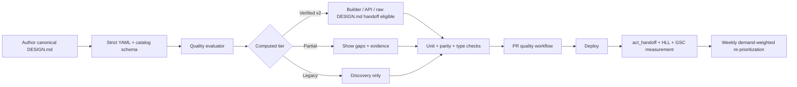

# oh-my-design v2 execution plan

Decision date: 2026-07-10
Positioning: **Verified brand context your coding agent can actually apply.**

## Outcome

Move from a 400-file gallery with ambiguous trust to a measured reference-to-agent activation product. The primary KPI is weekly unique web users completing a handoff (`act_handoff`) rather than sessions, raw generations, or one-day launch spikes.

Day-90 operating thresholds are provisional until the first 14 clean measurement days:

- 2× weekly activated handoff users;
- at least 25% of activated handoffs from outside Korea;
- 20 demand-weighted flagship references migrated to Verified v2, covering at least 70% of top-20 demand;
- sustained complete-weekday HLL floor of 600;
- at least five relevant non-brand organic clicks per day;
- acquisition/landing measurement corruption below 2%;
- 100% page/API/SEO parity with the canonical typed model; MCP is retired.

## Build and release pipeline

The PR workflow has independent CLI and Web/reference jobs. The reference job rebuilds generated data and fails on drift. A daily run re-evaluates evidence TTLs without making network checks a PR hard dependency. The archived MCP package is excluded from the release gate.

The Web merge gate currently requires the complete test suite and TypeScript check. Full Web ESLint is not marked required yet because the pre-existing baseline has seven unrelated React/Next errors; make it required only after a dedicated lint-baseline cleanup, so this pipeline starts green instead of institutionalizing ignored failures.

## Executable backlog

| ID | Status | Priority | Outcome | Acceptance criteria | KPI / gate | Issue mapping |
|---|---|---:|---|---|---|---|
| M0 | 🔶 code complete · deploy pending | P0 | Clean measurement cutover | GA bootstrap exists before hydration; reserved acquisition params cannot be emitted; complete-day ranges exclude today; install counter is pulled; pull failures return non-zero. | First 14 clean days; missing/internal attribution <2% | New v2 measurement item |
| M1 | 🔶 code complete · deploy pending | P0 | One activation event | Export, prompt copy, and install copy dual-fire `act_handoff {kind,surface,reference?}` while legacy events remain for continuity. | Weekly unique `act_handoff` users | Reframes old analytics issue #4 |
| Q0 | 🔶 code complete · deploy pending | P0 | Honest catalog tiers | `reference-quality` evaluator + generated manifest + tests + daily CI; no timestamp can self-promote a ref. | 0 stale/conflicted refs labelled Verified | Backbone for #37/#43 |
| AST0 | 🔶 code complete · deploy pending | P0 | One canonical reference model | Replace page, legacy route, API, builder, JSON-LD, and sitemap regex parsers with one typed AST and parity fixtures; retire MCP transport. | 100% primary/radius/font/status parity | Preserve and expand #37 |
| CAP0 | ✅ A0–A2 complete | P0 | Deterministic reference evidence | MCP-free multi-surface capture emits raw element provenance, font state, state-style snapshots, five active interaction kinds, and conservative coverage before model reconciliation. | Fixture precision/recall/F1 ≥0.95; current 1.0/1.0/1.0 | New v2 extraction item |
| F20 | 🔶 in progress · first 10 Verified v2 | P0 | Verified flagship set | Re-audit the top 20 by demand with surface/source/claim evidence and real font/license state. The first 10 passed the standardized deterministic + in-app hybrid audit. | ≥70% top-20 demand covered | Preserve and rewrite #43 |
| PAGE0 | ⬜ | P1 | Reference page v2 | Implement `spec/preview-v2.md`: surface switcher, REAL/SUBSTITUTE/SYSTEM fonts, evidence drawer, conflicts, checked date, version diff, agent-specific Use actions. | Detail → handoff ordered journey | #22 + preview-v2 |
| CAT0 | 🔶 code complete · deploy pending | P1 | All 400 discoverable honestly | Remove the `ds`-only directory filter; make the brand wall navigable; show computed status tiers. | 400 indexed entries, no false Verified copy | New v2 catalog item |
| R0 | ✅ adapter-ready · credentials pending | P1 | Periodic model-assisted reverify | Rank TTL/quality/demand gaps, emit provider-neutral high-reasoning packets, execute one shell-free budgeted worker, and enforce deterministic PR gates. | Due queue age; evidence upgrades/attempt; 0 model-promoted trust | New v2 reliability item |
| I18N0 | ⬜ | P1 | Focused global wedge | `/ko` and `/en` canonical routes + hreflang; English flagship pages for Baemin/Toss/Kakao; `/ja` and `/zh-tw` only after qualified activation. | ≥25% non-Korean handoffs | New v2 discovery item |
| VIRAL0 | ⬜ | P1 | Proof-led sharing loop | Same-prompt Without/With result, evidence/status/version OG card, contributor attribution, weekly diff feed. | Shared artifact → qualified handoff | Consolidate #33/#34/#35 later |
| SCAN0 | ⬜ | P2 | Qualified extractor intake | Add a clearly Auto-tiered URL scan only if extractor-intent pages produce activated handoffs. | Activation, not scan volume | Deferred experiment |

## Delivery slices

### Slice 1 — truth spine (this change)

- [x] Conservative v2 quality contract and generated status pipeline.
- [x] CI/pre-commit/release entry points for canonical reference changes.
- [x] Analytics taxonomy cutover guardrails and install-counter visibility.
- [x] Reproducible research notebook, report artifact, source notes, and validation memo.
- [ ] Merge, deploy, and mark the next complete day as clean-baseline day 1.

### Slice 2 — canonical model

- [x] `AST0-A0` — introduce the shared typed AST, pure normalizer, selectors, fixtures, and 400-reference fleet gate without switching consumers.
- [x] `AST0-A0M` — preserve deterministic parity in the historical MCP archive before retirement.
- [x] `AST0-A1` — switch the detail API behind a rollback flag and promote its parity contract to a hard gate.
- [x] `AST0-A2` — retire remote/stdio MCP and preserve raw/offline distribution through direct DESIGN.md access.
- [x] `AST0-A3` — switch SEO, JSON-LD, sitemap, catalog, and public status/count copy.
- [x] `AST0-A4` — switch both reference routes, token preview/font resolution, and builder.
- [ ] `AST0-A5` — after two releases and 14 clean days, remove duplicate parsers and prose-derived defaults from canonical surfaces.

Detailed execution order, dependencies, fixtures, and rollback rules live in `claudedocs/workflow_omd_v2_ast0.md`.

### Slice 3 — flagship proof and page

- [x] `CAP0-A0` — evidence v1 schema, local/packaged Playwright collector, font state chain, component coverage, and skill/reverify packet wiring.
- [x] `CAP0-A1` — detail-page evidence snapshot plus Toss/Karrot live smoke capture.
- [x] `CAP0-A2` — known-CSS/font/state fixture precision/recall/F1 and interaction expansion (all 1.0 baseline).
- [ ] Migrate the top 20 references through the v2 evidence contract.
- [x] First set: Toss, Apple, Karrot, Baemin, Kakao, Naver, KRDS, Yeogiotte, 29CM, and LINE complete; hybrid batch audit 10/10 pass.
- [ ] Implement the existing preview-v2 specification against the typed AST.
- [ ] Ship direct Codex/Claude/Cursor/v0 handoff and mobile-safe copy/download behavior.

### Slice 4 — focused international distribution

- [ ] Localized canonical routing and structured data.
- [ ] English evidence pages for difficult-to-source Korean brands.
- [ ] Agent-intent guides with deep handoff links.
- [ ] Registry/ecosystem submissions and proof-led share cards.

## Rollout and rollback

- Quality tier rollout is additive: generated status is exposed before any legacy badge is removed. If a consumer disagrees, the manifest wins and the page falls back to Partial/Legacy.
- The detail API uses Reference AST v1 by default. Set `REFERENCE_AST_V2=0`, `false`, or `off` to return the exact legacy payload while investigating a parity regression.
- Analytics events dual-fire through one taxonomy version. Rollback removes the new event while preserving historical events and Redis counters.
- Network liveness is advisory/nightly, never a PR hard gate. A third-party outage cannot block a content correction.
- No persistent CLI/project telemetry is introduced. Activation remains a web/remote proxy unless a separate product decision changes that promise.

## Issue hygiene

Keep #37, #43, and #22 and replace their acceptance criteria with AST parity, demand-weighted verification, and direct handoff respectively. Consolidate #33/#34/#35 into a later Fidelity receipt epic after the typed model exists. Do not mass-close issues until the v2 epic links each retained acceptance criterion; then close only genuinely superseded launch-sprint issues.
